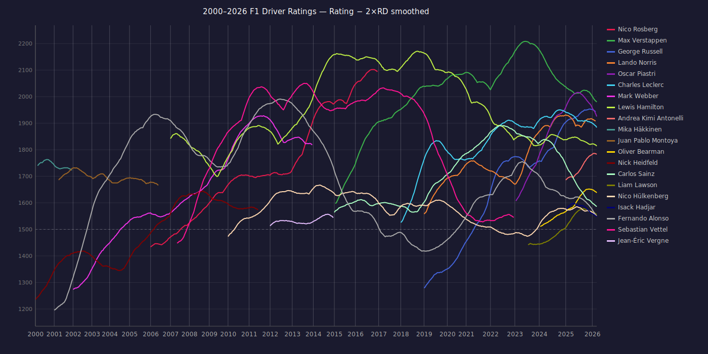

# multicompetitor

[](https://pkg.go.dev/github.com/proglottis/multicompetitor)

Track how competitor ability changes across a series of ranked contests —
races, tournaments, seasons, or any setting where multiple participants finish
in order.

Each competitor gets a Gaussian ability estimate that updates after each
contest, drifts when they sit one out, and can be smoothed retrospectively
once a run of results is complete. Ties are handled natively.

## What it's for

- **Ongoing rating systems** — feed results in as they happen; each call
  returns updated ratings ready to store and display.
- **Retrospective analysis** — smooth a competitor's full history after the
  season ends to get sharper estimates of when they peaked.

## Installation

```
go get github.com/proglottis/multicompetitor
```

No external dependencies.

## Quick example

```go
const (
    tau    = 0.1 // per-race ability drift
    sigma0 = 1.5 // initial uncertainty for new competitors
)

// history accumulates each competitor's per-period posteriors for smoothing.
history := make(map[string][]multicompetitor.PeriodRating)

var priors map[string]multicompetitor.PeriodRating
for _, race := range season {
    var contest []multicompetitor.Contest[string]
    for _, r := range race.Results {
        contest = append(contest, multicompetitor.Contest[string]{
            ID:   r.DriverID,
            Rank: r.FinishingPosition,
        })
    }
    priors = multicompetitor.RatePeriod(priors, tau, sigma0, contest)
    for id, pr := range priors {
        history[id] = append(history[id], pr)
    }
}

// Smooth one competitor's full history retrospectively:
smoothed := multicompetitor.Smooth(history["hamilton"], tau)
```

New competitors are initialised automatically on first appearance. A
competitor who misses a period has their uncertainty widened — the model
acknowledges that their ability may have changed while they were away.

## Tuning

| Parameter | What it controls | Starting point |
|-----------|-----------------|----------------|
| `tau` | How quickly ability can change between periods. Lower is more stable; higher reacts faster to recent form. | `0.1` per race |
| `sigma0` | How uncertain you are about a new competitor. Wider priors converge more slowly but avoid overreacting to early results. | `1.5` |

Ratings are on a Glicko-compatible scale: μ=0 corresponds to 1500 and one
unit is roughly 174 rating points.

## F1 driver ratings 2000–2026



Smoothed conservative estimates (μ − 2σ) for the top 20 drivers by final
rating, produced by `cmd/f1/` using results from the Jolpica F1 API.

## How it works

The library implements the approximate filter and RTS smoother from
[Glickman & Hennessy (2015)](https://www.glicko.net/research/multicompetitor.pdf).
Ability is modelled as a Gaussian random walk; contest outcomes follow a
rank-ordered logit (Plackett-Luce) model with the Breslow-Crowley
approximation for ties. The per-period posterior mode is found via
Newton-Raphson — a Laplace approximation rather than full Bayesian inference.
